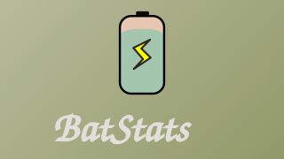

[English](README.md) | [简体中文](README.zh-CN.md) | [日本語](README.ja.md)

# BatStats



Detailed Stats will not show some of the stats (dependent on device). The app doesn't handle most edge cases, but does almost always work for important ones, like power consumption stats ( in mah ) for all apps.

## Advanced Stats

Root and shizuku do not require any commands (self-explantory). ADB requires privileged perms (adb method to grant):

  ```sh
  for p in DUMP BATTERY_STATS PACKAGE_USAGE_STATS INTERACT_ACROSS_USERS; do adb shell pm grant org.mlm.batstats android.permission.$p; done
  ```
  Then force-stop BatStats (or reboot) and re-open. Check Settings -> Advanced Stats for grant status (can copy commands there too).

## Contributing
Issues and PRs are welcome. (Do try to make sure that the issue is not OS specific before submitting)

## License
See [LICENSE](LICENSE) file for details.
